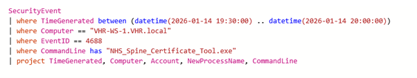
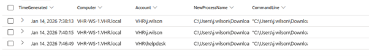

# Incident Report: Warlock Ransomware Attack

**FROM:** MahCyberDefense SOC Team  
**TO:** Richard Oakley  
**DATE:** January 16, 2026  
**PRIORITY:** CRITICAL

---

## 1. Executive Summary

On 14 January 2026, VHR was targeted by a human-operated ransomware attack (Warlock) that resulted in full domain compromise, exfiltration of sensitive data, and enterprise-wide encryption.  

The attack began when a contractor executed a phishing attachment (`NHS_Spine_Certificate_Tool.exe`), allowing the adversary to escalate privileges and compromise core infrastructure, including the domain controller and backup systems.  

The attacker staged enterprise data into a centralized archive (`loot.zip`), disabled security protections, and deleted local recovery features to maximize disruption.  

**Impact:** Business operations halted due to encrypted file shares and backups; privileged credentials fully compromised.  

**Current Status:**  
- **Containment:** No further execution of `warlock.exe` observed after 21:33 UTC; compromised hosts isolated (`VHR-WS-1`, `VHR-DC01`, `VHR-BACKUP`).  
- **Credential Compromise:** `svc_backup` and `helpdesk` accounts fully compromised.  
- **Backup Status:** Local backups and shadow copies destroyed; restoration depends on secure off-site backups.  
- **Security Controls:** Defender protections disabled; persistent tasks and encrypted tunnels detected.  

**Immediate Action Required:** Reset all privileged credentials and verify containment before restoring services.

---

## 2. Findings

### 2.1 Initial Access & Execution
- **Technique:** Spear-Phishing Attachment (T1566.001)  
- **Time:** 19:38 UTC  
- **User:** VHR\j.wilson  
- **Host:** VHR-WS-1  

**Activity:** Execution of `NHS_Spine_Certificate_Tool.exe` triggered a fileless PowerShell loader, establishing initial foothold. Internal reconnaissance began immediately.  

Secondary toolkit downloaded from: `https://sync.cloud-endpoint.net/update.msi`.

---

### 2.2 Persistence & Command and Control (C2)

**Persistence – Scheduled Task (T1053.005):**  
- Task: `NHSSpineSync` on `VHR-WS-1`  
- Runs attacker tooling at user logon  
- Created via `schtasks.exe` (Event ID 4688)

**Command and Control (T1572):**  
- Encrypted outbound tunnels via VS Code Tunneling (`code.exe`) and cloudflared  
- Blended with normal HTTPS activity for stealth

---

### 2.3 Credential Access & Privilege Escalation

**Valid Account Abuse (T1078.003):**  
- Pivoted from contractor → `VHR\helpdesk` → `VHR\svc_backup`  

**Kerberoasting (T1558.003):**  
- Encrypted Kerberos service tickets captured and cracked offline  

**Result:** Full domain administrative control gained.

---

### 2.4 Lateral Movement & Discovery
- Lateral movement from `VHR-WS-1` to `VHR-DC01` (Domain Controller) and `VHR-BACKUP` (Backup server)  
- Internal enumeration: domain users, network shares, AD structure, backups

---

### 2.5 Data Collection & Exfiltration
**Staging:**  
- Sensitive data copied to `C:\Windows\Temp\exfil`  
- Compressed into `loot.zip`

**Exfiltration:**  
- Via VS Code Tunnel (`code.exe`) and cloudflared encrypted channels

---

### 2.6 Defense Evasion
- **Disable Protections:** Windows Defender disabled (T1562)  
- **Shadow Copies Removed:** `vssadmin.exe delete shadows /all /quiet` (T1490)  
- **Critical Services Stopped:** SQL Server, VSS, Backup services  

---

### 2.7 Impact
- Loss of availability of `C:\Shares` and `D:\Backups`  
- Backup data encrypted  
- Domain infrastructure affected  
- Rapid spread due to elevated privileges

---

## 3. Recommendations

**Immediate (0–24h):**  
- Reset all Domain Admin and Service account passwords; replace `svc_backup` with gMSA  
- Isolate affected servers  
- Block tunneling domains at firewall

**Short-term (1–7 days):**  
- Restore data only from verified off-site backups  
- Enforce complex passwords for service accounts

**Long-term (30–90 days):**  
- Require MFA for all administrative accounts  
- Segment backup infrastructure into separate monitored network

---

## 4. Appendix – Evidence Summary

4.1 Initial Access – Execution of Malicious Payload

**Objective:** Identify the entry point and execution of the phishing attachment.  
**Finding:** Contractor `j.wilson` executed `NHS_Spine_Certificate_Tool.exe`, then helpdesk executed it — lateral movement / privilege escalation confirmed.

4.2 Persistence – Scheduled Task Creation

  

**Objective:** Identify how the attacker ensured persistence.  
**Finding:** NHSSpineSync scheduled task created under helpdesk account to maintain access.

4.3 Lateral Movement – Access to Domain Controller

  

**Objective:** Show movement to critical domain resources.  
**Finding:** Lateral movement using `svc_backup` to DC and backup server.

4.4 Data Staging Activity

  

**Objective:** Track how data was gathered for exfiltration.  
**Finding:** Copied `C:\Shares` and `C:\Backups\SQL` into `C:\Windows\Temp\exfil` and compressed into `loot.zip`.

4.5 Command & Control – Encrypted Tunneling Tools

  

**Objective:** Identify how the attacker maintained remote access.  
**Finding:** `code.exe` and cloudflared used to establish encrypted outbound tunnels.

4.6 Defense Evasion – vssadmin delete shadows

  

**Objective:** Identify actions to prevent recovery and disable security.  
**Finding:** Shadow copies deleted using `vssadmin.exe delete shadows /all /quiet`.

4.7 Ransomware Execution – warlock.exe

  

**Objective:** Observe ransomware deployment.  
**Finding:** Warlock ransomware deployed across network, executed with system privileges.

4.8 Discovery – Domain Enumeration & Target Identification

  

**Objective:** Identify commands used to enumerate high-privileged groups and domain controllers.  
**Finding:** Aggressive enumeration using helpdesk account; mapped administrative structure.

---

## 5. Timeline (UTC)

| Time       | Host       | Activity |
|------------|-----------|---------|
| 19:38:13   | VHR-WS-1  | `j.wilson` executes phishing payload – Initial Access |
| 19:46:49   | VHR-WS-1  | Execution under `helpdesk` – Privilege Escalation |
| 20:03:24   | VHR-WS-1  | `NHSSpineSync` scheduled task created – Persistence |
| 20:10:18   | VHR-WS-1  | `powershell.exe` downloads code.zip |
| 20:12:00   | VHR-WS-1  | `code.exe` tunnel executed – Encrypted C2 |
| 20:29:30   | VHR-WS-1  | `net group "Domain Admins"` – Privilege Enumeration |
| 20:30:02   | VHR-WS-1  | `nltest /dclist:VHR.local` – DC Discovery |
| 20:33:57   | VHR-DC01  | `svc_backup` network logon – Lateral Movement |
| 20:34:39   | VHR-BACKUP| `svc_backup` logon – Backup Compromise |
| 21:10:45   | VHR-DC01  | Data staged to Temp\exfil and compressed |
| 21:20:15   | VHR-DC01  | `vssadmin delete shadows` executed |
| 21:26:37   | VHR-DC01  | `warlock.exe` executed – Ransomware Deployment |
| 21:27:47   | VHR-BACKUP| `warlock.exe` executed on backup systems |
| 21:29:16   | VHR-WS-1  | `warlock.exe` spreads to workstation |
| 21:33:05   | VHR-DC01  | `warlock.exe` targets C:\Shares, D:\Backups – Encryption |

---

## 6. MITRE ATT&CK Mapping

| Tactic | Technique Name | ID | Observed Activity |
|--------|----------------|----|-----------------|
| Initial Access | Phishing | T1566.001 | Payload executed by `j.wilson` |
| Execution | User Execution | T1204.002 | Ran `NHS_Spine_Certificate_Tool.exe` |
| Persistence | Scheduled Task | T1053.005 | NHSSpineSync task created |
| Privilege Escalation | Valid Accounts | T1078.002 | `svc_backup` used for DC & Backup |
| Defense Evasion | Inhibit System Recovery | T1490 | Shadow copies deleted |
| Discovery | Account Discovery | T1087.002 | `net group "Domain Admins"` |
| Discovery | Remote System Discovery | T1018 | `nltest /dclist` |
| Lateral Movement | SMB/Admin Shares | T1021.002 | Network logon to DC/Backup |
| Collection | Archive via Utility | T1560.001 | Data consolidated in `Temp\exfil\loot.zip` |
| Command & Control | Protocol Tunneling | T1572 | `code.exe` used to bypass firewall |
| Impact | Data Encrypted | T1486 | Warlock deployed enterprise-wide |

---

## 7. IOC List

**Network Indicators**

| Type | Indicator | Description |
|------|-----------|------------|
| IP | 192.168.50.6 | Source for lateral movement |
| Domain | sync.cloud-endpoint[.]net | Hosts second-stage payload |
| Domain | *.relay.tunnels.api.visualstudio[.]com | VS Code Tunnel relay |
| Domain | *.cloudflare-gateway[.]com | Cloudflared outbound tunnel |

**Host-Based Indicators**

| Type | Indicator | Description |
|------|-----------|------------|
| File | `*\NHS_Spine_Certificate_Tool.exe` | Initial phishing payload |
| File | `C:\Windows\Temp\code.exe` | VS Code Tunnel binary |
| File | `C:\Windows\Temp\warlock.exe` | Ransomware executable |
| File | `C:\Windows\Temp\exfil\loot.zip` | Staged archive |
| Scheduled Task | NHSSpineSync | Persistence task |
| Registry | `HKLM\Software\Microsoft\Windows Defender\DisableAntiSpyware=1` | Disabled Defender |
| Registry | `HKLM\Software\Microsoft\Windows Defender\Real-Time Protection\DisableRealtimeMonitoring=1` | Disabled realtime monitoring |
| Utility | `vssadmin.exe delete shadows` | Shadow copies deleted |

